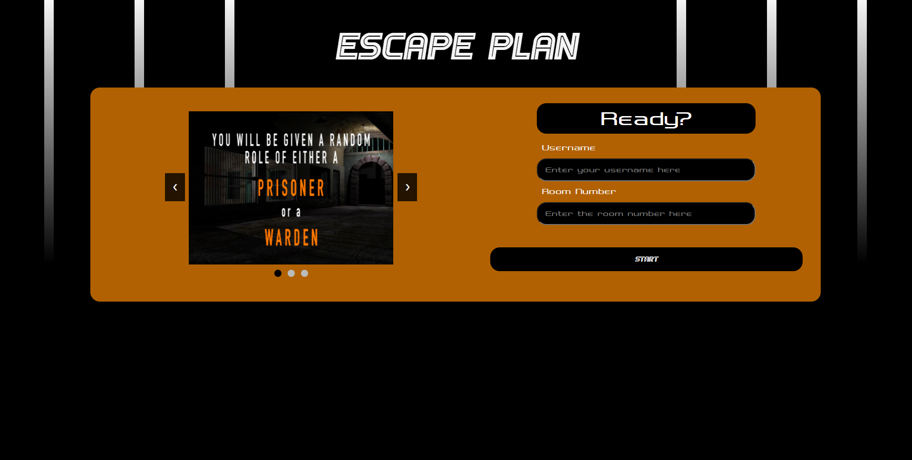

# Escape Plan

- multi player game
- implemented with socket.io and typeScript<br />
- [notion.so](https://sulfuric-gondola-9de.notion.site/5ffc8294fe384b2ab79ce831365ef520?v=870d68682b724e5784f6ad3b332b8a5f)
## developed by<br />
Natthakit Kitrueangphatchara 6238056021<br />
Warit Leelaket 6238191021<br />
Siraphop Thaisangsa-nga 6238220521<br />
Naris Limpapaswat 6238100921<br />
Panupong Vijakwichakorn 6238160521<br />
## Start server on local
start server with watch mode <br />
-- any change in .js .html .ts files will restart the server --

``` 
npm run dev 
```
access server at 
```
localhost:3000
```

## Production 

build docker image 

```
docker build --tag escapegame:"__tagname" . // for example "docker build --tag escapegame:test ."
```

run docker 

``` 
docker run --name escapegame -p 3000:3000 -d escapegame:"__tagname"
```

stop docker 

```
docker kill escapegame 
docker rm escapegame
```

## git command
for set up remote 
https://docs.github.com/en/get-started/getting-started-with-git/managing-remote-repositories

clone repo
```
git clone https://github.com/latte34844/EscapeGame.git
```

pull changed code to local
```
git pull origin main
```

check  status (see changed from last commit)
```
git status
```

commit new change
```
git add .

git commit -m "{any comments}"

git push origin main
```
